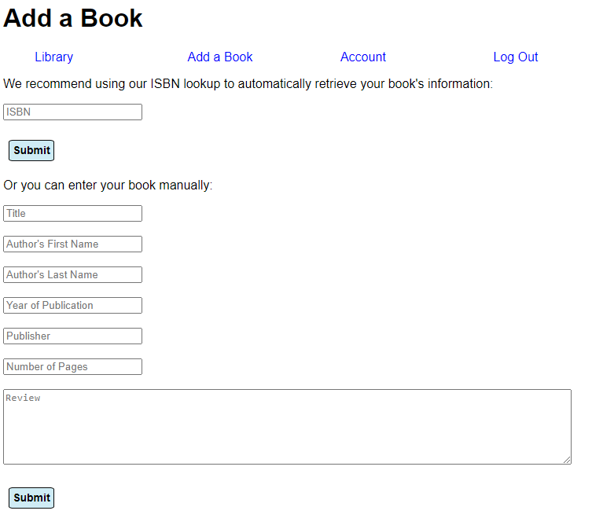
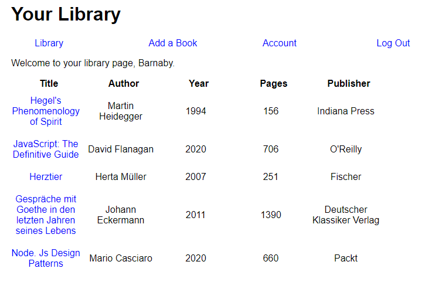
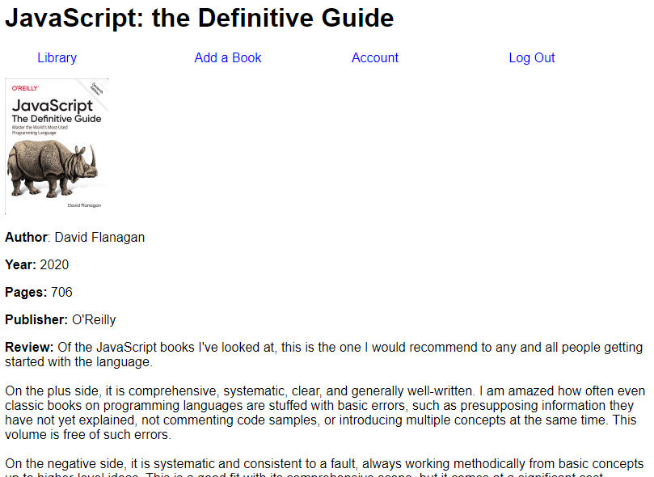

# Bibliotech Library App

Bibliotech is a web app that allows users to create an account and add book information for their personal libraries. I created it from scratch as a project/demo application.

**Status**: This project is currently in development.

## Some interesting features

* Pages are dynamically generated based on the logged-in user
* Enter the ISBN and the app will retrieve the book data and cover image from Google Books API and add it to your library
* Served with Express
* Uses a MySQL backend (3NF)
* Uses passport-local for session authentication
* Passwords are hashed and salted

## Gallery

Passport session authentication:

Easy data entry leveraging the Google Books API:

Dynamically-generated pages using Handlebars hbs:

## Design Comments

My goal is to create an end-to-end web application that includes all necessary representative functionality, including a backend data store suitable for professional use and real-world security features including session-based authentication, input sanitization, and password hashing.

I previously worked on a [demo app](https://github.com/barnaby0101/udemy-complete-nodejs-projects/tree/main/project-3-task-manager) that made heavy use of promises and used MongoDB as a backend, so for this application I chose to use a MySQL database and the older callback pattern to handle asynchronous interactions.

One of the first interesting design questions that came up was how best to deal with asynchronous database communications. I initially opted to use promises, and found the excellent npm module `promises-mysql` very easy to use and a good fit for my project. However, the `passport` module I chose to use for authentication does not support promises, and my research led me to quickly conclude that attempting to promisify it would be prohibitively difficult. So I stripped out most of my promise-handling for the sake of consistency and rewrote all of my database queries using callbacks.

I quickly found that although the basic concept of a library catalog system is simple, the implementation details quickly became complicated. I opted to focus on a design that was sophisticated enough to reflect some of the complications of the underlying data ontology while not getting carried away in dealing with special cases. To implement a product like this as a professional project, some of these considerations would have to be more carefully ironed out.

For example, the question arises whether there should be a unique record of each book for each specific user, or whether there should instead be one record for each book with the ownership relationships captured by a junction table. I opted for the latter approach because it is for more scalable, and it is consistent with my goal of 3NF normalization for my database backend. Duplicating book records per user would result in considerable redundancy.

In actual practice, one is immediately catapulted into thorny questions regarding what constitutes a "single book". Are different editions of the same book "one book" or "two books"? What about translations? These questions are outside of the scope of this project, but they are at least worth mentioning as a complication.

For the purposes of this app, two books are "the same" if they have the same title and author. That reduces redundancy in backend storage, but it has limitations that would make it impractical in production.

Hats off to Google for their Books API. There are features of this app that were a lot more difficult to implement than the ISBN lookup, but for me, none is more magical. Enter an ISBN and it'll pull the title, author, and other information from Google. It's quite satisfying to see it work.

I would like to eventually extend this with a mobile application that scans barcodes and leverages this API to add books to your library that way - that is definitely on my wish list.